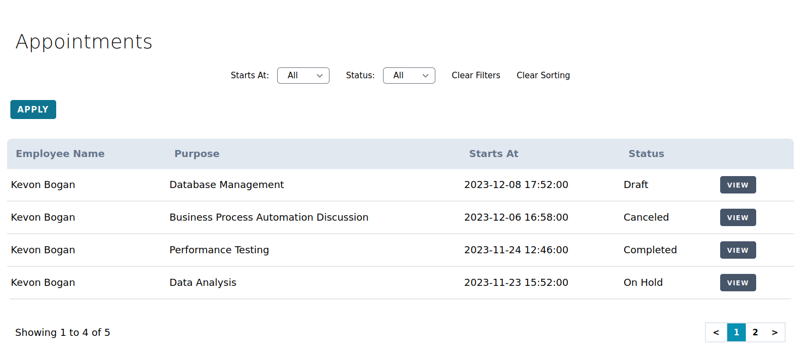
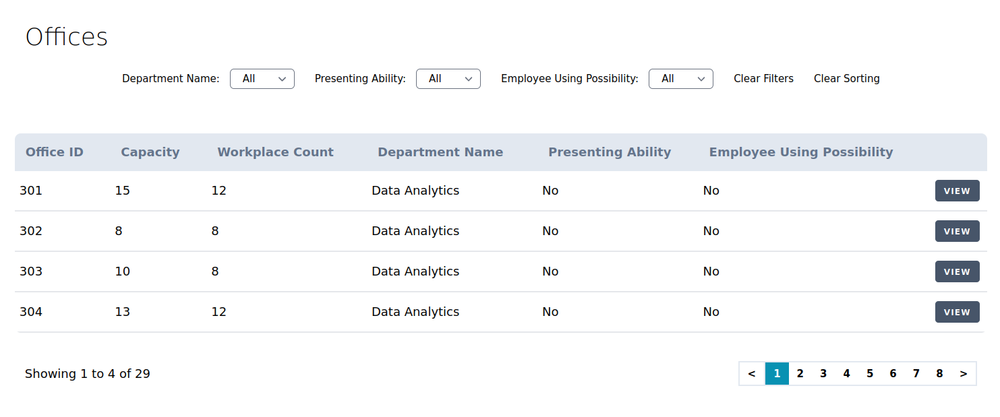
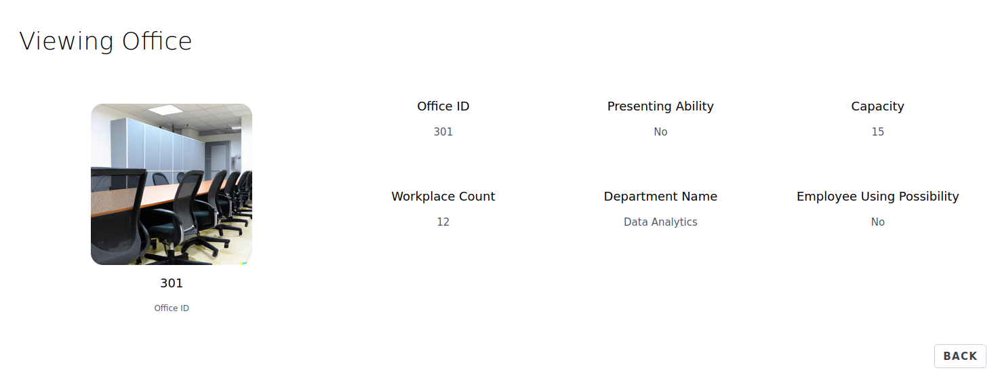
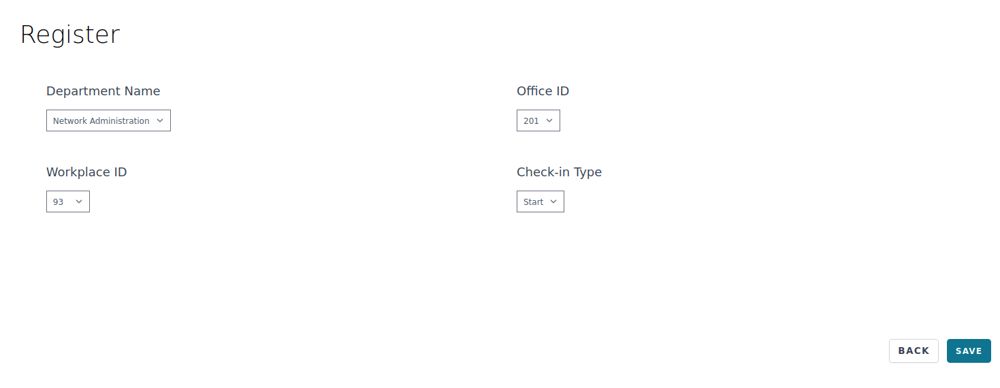
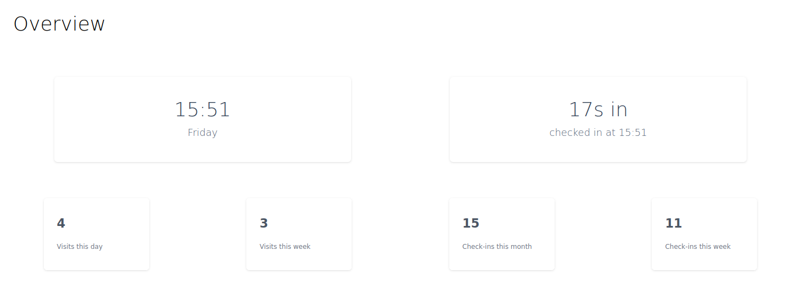

## About Office flow 

Office flow is a web application that offers intuitive and user-friendly
interface for effortless time, space, and appointment tracking.

## User roles 

There are 3 roles: user, employee, and admin. Each have their own actions they can do.
All 3 user groups have the same interface meaning there are no 'internal' admin or employee panel.

### Available actions 

- User: apply, cancel, view appointments for appointments; view offices
- Employee: view statistics; check in; view offices; view, confirm, cancel appointments
- Admin: CRUD for offices, appointments, offices 

## Functionality 

I will show some examples of functionality available for different user roles.

### User 

User can apply and view their appointment list.

User can view office list.

User can view office information.

### Employee 

Employee can view their check ins.

Employee can check in.

Employee can view statistics and current status.

